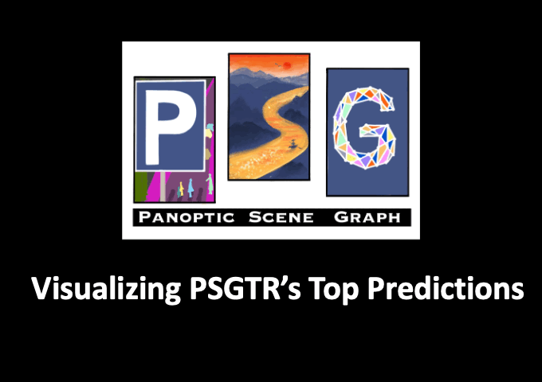

# Panoptic Scene Graph (PSG)

<p align="center">
  
</p>

This folder documents **PSG** ([Panoptic Scene Graph Generation](https://arxiv.org/pdf/2207.11247)) and how we prepare **TOON** labels and **Swift-style JSONL** inside **SceneGraphVLM** under `datasets/annotations/PSG_annot/`.

## Quick Start

Use this path when preparing PSG from a fresh clone.

1. Install the local preprocessing environment:

   ```bash
   bash envs/sh_scripts/install_dataset_preprocessing_env.sh
   conda activate scenegraphvlm_data_prep
   ```

2. Prepare PSG annotations and pixels. The easiest path uses Hugging Face:

   ```bash
   python datasets/tools/prepare_all_annotations.py \
     --datasets psg \
     --psg-from-hf \
     --overwrite
   ```

   If `datasets/annotations/PSG_annot/annotations/{train,test}_annotations.json` already exists, you may omit `--psg-from-hf`.

The command downloads or reads PSG annotations, builds resized frames and intermediate TOON JSON, exports base SFT JSONL, cleans the scene graphs, rewrites image paths to `/workspace/datasets/frames/...`, and writes final SFT / GRPO variants under `datasets/data_playground/PSG_json/`.

The detailed sections below are for manual debugging, path overrides, and reference.

| Resource | Link |
|----------|------|
| **Paper (PSG / OpenPSG)** | [arXiv:2207.11247](https://arxiv.org/pdf/2207.11247) |
| **Official code** | [github.com/Jingkang50/OpenPSG](https://github.com/Jingkang50/OpenPSG.git) |

We also reference **recent work** that released a **PSG scene-graph prompt dataset** on Hugging Face (format-aligned with modern SFT pipelines):

| Resource | Link |
|----------|------|
| **Paper** | [arXiv:2504.13617](https://arxiv.org/pdf/2504.13617) |
| **Hugging Face train dataset** | [`JosephZ/psg_train_sg`](https://huggingface.co/datasets/JosephZ/psg_train_sg) |
| **Hugging Face test dataset** | [`JosephZ/psg_test_sg`](https://huggingface.co/datasets/JosephZ/psg_test_sg) |

Our `prepare_original_psg_sft.py` pulls **PSG panoptic** annotations and pixels from separate Hub datasets (`JosephZ/psg_train_sg`, `JosephZ/psg_test_sg` — see script).

## Prerequisites

- **Python 3**
- **`datasets`**, **`Pillow`**, **`tqdm`** (and other deps from the repo)

Install the local dataset-preprocessing environment:

```bash
# from the SceneGraphVLM repository root
bash envs/sh_scripts/install_dataset_preprocessing_env.sh
conda activate scenegraphvlm_data_prep
```

This environment is only for dataset preparation and annotation generation. Training and validation are expected to run inside the project Docker container mounted at `/workspace`.

## 1. Annotation JSON on disk

Place **train** / **test** lists under:

```text
datasets/annotations/PSG_annot/annotations/
  train_annotations.json
  test_annotations.json
```

Each row follows the OpenPSG-style structure (`image_id`, `objects`, `relationships`, ...). If files are missing, the preparation script can fetch them from Hugging Face (`--from-hf`).

## 2. SceneGraphVLM tools (TOON + frames + JSONL)

Run from the **repository root** (`SceneGraphVLM`).

### 2.1 `prepare_original_psg_sft.py`

- Reads `annotations/{train,test}_annotations.json` (or downloads them with `--from-hf`).
- Resizes pixels to **640×480** and writes PNGs under `datasets/frames/PSG_frames/{train_images,test_images}/`.
- By default, **images are loaded from Hugging Face** (`JosephZ/psg_train_sg` / `JosephZ/psg_test_sg`) unless each row already has a valid local `image_path` and you pass `--no-hf-images`.
- Writes intermediate TOON JSON:

  `datasets/annotations/PSG_annot/data_sft_original/train_annotations_toon_sft.json`  
  `datasets/annotations/PSG_annot/data_sft_original/test_annotations_toon_sft.json`

**First-time setup (download annotations + build everything):**

```bash
cd /path/to/SceneGraphVLM

python datasets/annotations/PSG_annot/tools/prepare_original_psg_sft.py --from-hf
```

**If JSON already exists** (rebuild frames + TOON. Pulls pixels from HF again unless `--no-hf-images`):

```bash
python datasets/annotations/PSG_annot/tools/prepare_original_psg_sft.py
```

**Useful flags**

| Flag | Meaning |
|------|---------|
| `--repo_root` | SceneGraphVLM root (auto-detected if empty). |
| `--annotations_dir` | Where `train_annotations.json` / `test_annotations.json` live (default `datasets/annotations/PSG_annot/annotations`). |
| `--export_root` | Output dir for `*_annotations_toon_sft.json`. |
| `--images_out` | Root for PNGs (default `datasets/frames/PSG_frames`). |
| `--from-hf` | If JSON is missing, download annotation lists from HF and save under `annotations/`. |
| `--no-hf-images` | Do not decode images from HF. Every row must resolve to a local file. |
| `--skip-sft` | Skip a split if its `*_annotations_toon_sft.json` already exists. |

### 2.2 `sft_to_jsonl_psg.py`

Reads the intermediate JSON and writes **Swift-style chat JSONL** (single image per row, user prompt = template + inlined categories + example):

- `datasets/data_playground/PSG_json/train.jsonl`
- `datasets/data_playground/PSG_json/test.jsonl`

```bash
cd /path/to/SceneGraphVLM

python datasets/annotations/PSG_annot/tools/sft_to_jsonl_psg.py
```

**Path overrides:**

```bash
python datasets/annotations/PSG_annot/tools/sft_to_jsonl_psg.py \
  --repo_root /path/to/SceneGraphVLM \
  --export_root datasets/annotations/PSG_annot/data_sft_original \
  --out_dir datasets/data_playground/PSG_json
```

### 2.3 User prompt

```text
<image>
Generate a structured scene graph for an image of size (640 x 480) using the specified object and relationship categories.

Output Format:

<answer>
obj[N]{id,name,x1,y1,x2,y2}:
  id,name,x1,y1,x2,y2
  ...
rel[M]{subj,pred,obj}:
  subj,pred,obj
  ...
</answer>

Guidelines:
- Objects:
  - Use integer IDs starting from 1 in the id field (e.g., 1, 2, 3).
  - The object name must belong to the predefined object set: ["person", "bicycle", "car", "motorcycle", "airplane", "bus", "train", "truck", "boat", "traffic light", "fire hydrant", "stop sign", "parking meter", "bench", "bird", "cat", "dog", "horse", "sheep", "cow", "elephant", "bear", "zebra", "giraffe", "backpack", "umbrella", "handbag", "tie", "suitcase", "frisbee", "skis", "snowboard", "sports ball", "kite", "baseball bat", "baseball glove", "skateboard", "surfboard", "tennis racket", "bottle", "wine glass", "cup", "fork", "knife", "spoon", "bowl", "banana", "apple", "sandwich", "orange", "broccoli", "carrot", "hot dog", "pizza", "donut", "cake", "chair", "couch", "potted plant", "bed", "dining table", "toilet", "tv", "laptop", "mouse", "remote", "keyboard", "cell phone", "microwave", "oven", "toaster", "sink", "refrigerator", "book", "clock", "vase", "scissors", "teddy bear", "hair drier", "toothbrush", "banner", "blanket", "bridge", "cardboard", "counter", "curtain", "door-stuff", "floor-wood", "flower", "fruit", "gravel", "house", "light", "mirror-stuff", "net", "pillow", "platform", "playingfield", "railroad", "river", "road", "roof", "sand", "sea", "shelf", "snow", "stairs", "tent", "towel", "wall-brick", "wall-stone", "wall-tile", "wall-wood", "water-other", "window-blind", "window-other", "tree-merged", "fence-merged", "ceiling-merged", "sky-other-merged", "cabinet-merged", "table-merged", "floor-other-merged", "pavement-merged", "mountain-merged", "grass-merged", "dirt-merged", "paper-merged", "food-other-merged", "building-other-merged", "rock-merged", "wall-other-merged", "rug-merged"].
  - Provide the bounding box [x1, y1, x2, y2] in integer pixel format.
  - Include all visible objects, even if they have no relationships.

- Relationships:
  - Represent interactions using integer object IDs in subj and obj.
  - The pred (predicate) must belong to the predefined relationship set: ["over", "in-front-of", "beside", "on", "in", "attached-to", "hanging-from", "on-back-of", "falling-off", "going-down", "painted-on", "walking-on", "running-on", "crossing", "standing-on", "lying-on", "sitting-on", "flying-over", "jumping-over", "jumping from", "wearing", "holding", "carrying", "looking-at", "guiding", "kissing", "eating", "drinking", "feeding", "biting", "catching", "picking", "playing-with", "chasing", "climbing", "cleaning", "playing", "touching", "pushing", "pulling", "opening", "cooking", "talking-to", "throwing", "slicing", "driving", "riding", "parked on", "driving-on", "about-to-hit", "kicking", "swinging", "entering", "exiting", "enclosing", "leaning-on"]
  - Omit relationships for orphan objects.

Example output:

<answer>
obj[7]{id,name,x1,y1,x2,y2}:
  1,person,281,272,524,438
  2,umbrella,273,123,640,434
  3,house,0,88,262,426
  4,window-other,163,262,195,294
  5,tree-merged,0,0,640,440
  6,sky-other-merged,0,0,459,123
  7,building-other-merged,537,164,640,291
rel[5]{subj,pred,obj}:
  1,in-front-of,5
  3,attached-to,4
  4,hanging-from,3
  5,beside,3
  6,over,5
</answer>

Now, generate the complete scene graph for the provided image. Write your response only between <answer> and </answer> tags.
```

### 2.4 Manual pipeline (debug/reference)

```bash
cd /path/to/SceneGraphVLM

# 1) Annotations + 640x480 frames + TOON JSON (HF by default)
python datasets/annotations/PSG_annot/tools/prepare_original_psg_sft.py --from-hf

# 2) Swift jsonl
python datasets/annotations/PSG_annot/tools/sft_to_jsonl_psg.py

# 3) Build final clean annotation variants for SFT and GRPO
python datasets/tools/build_annotation_variants.py --only psg --overwrite
```

For normal use, prefer the Quick Start command at the top of this README.

## 3. Final clean variants

The repo-level variant builder is the canonical final step for PSG:

```bash
cd /path/to/SceneGraphVLM

python datasets/tools/build_annotation_variants.py --only psg --overwrite
```

It repairs malformed scene graphs where possible, drops rows with zero valid relations, rewrites image paths to `/workspace/datasets/frames/...`, and generates SFT `train/test/eval` plus matching GRPO variants under `grpo/`. Use `--emit-unclean` if you also need a debug copy of the unclean pre-filtered variants under `unclean/`; use `--no-clean` only when intentionally reproducing raw rows.

For the full from-scratch pipeline across all datasets, prefer:

```bash
python datasets/tools/prepare_all_annotations.py --datasets all --overwrite
```

**Outputs**

- `datasets/data_playground/PSG_json/train.jsonl`
- `datasets/data_playground/PSG_json/test.jsonl`
- `datasets/data_playground/PSG_json/eval.jsonl`
- `datasets/data_playground/PSG_json/grpo/{train,test,eval}.jsonl`
- `datasets/data_playground/PSG_json/annotation_variants_report.json`

## 4. Directory tree (expected layout)

```text
SceneGraphVLM/
├── datasets/
│   ├── annotations/
│   │   └── PSG_annot/
│   │       ├── PSG_README.md
│   │       ├── figure/
│   │       │   └── psgtr_long.gif      # teaser from OpenPSG (this README)
│   │       ├── annotations/            # train_annotations.json, test_annotations.json (often local only)
│   │       ├── data_sft_original/    # prepare_original_psg_sft.py
│   │       │   ├── train_annotations_toon_sft.json
│   │       │   └── test_annotations_toon_sft.json
│   │       └── tools/
│   │           ├── prepare_original_psg_sft.py
│   │           └── sft_to_jsonl_psg.py
│   ├── frames/
│   │   └── PSG_frames/
│   │       ├── train_images/
│   │       └── test_images/
│   └── data_playground/
│       └── PSG_json/
│           ├── train.jsonl
│           ├── test.jsonl
│           ├── eval.jsonl
│           ├── annotation_variants_report.json
│           └── grpo/
│               ├── train.jsonl
│               ├── test.jsonl
│               └── eval.jsonl
```

## References

- **PSG / OpenPSG:** [arXiv:2207.11247](https://arxiv.org/pdf/2207.11247) · [OpenPSG (GitHub)](https://github.com/Jingkang50/OpenPSG.git)
- **PSG SGG prompts (related HF data):** [arXiv:2504.13617](https://arxiv.org/pdf/2504.13617) · [`JosephZ/psg_train_sg`](https://huggingface.co/datasets/JosephZ/psg_train_sg_prompt) · [`JosephZ/psg_test_sg`](https://huggingface.co/datasets/JosephZ/psg_test_sg_prompt)

---

## Related documentation

- [SceneGraphVLM project README](../../../README.md) · [Metrics](../../../metrics/metrics.md) · [SFT](../../../sft/SFT_README.md)  
- [PVSG README](../PVSG_annot/PVSG_README.md) · [AG README](../AG_annot/AG_README.md)
