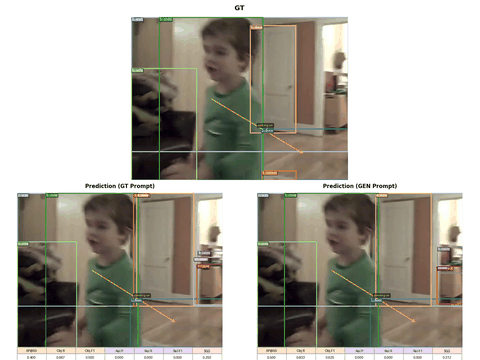

# Visualization

## Demo (PVSG)

Layout: **top** — ground-truth scene graph per frame; **bottom** — **GT-prompt** prediction (left) vs **GEN-prompt** prediction (right).

The README uses a **GIF** so GitHub shows an inline preview reliably; HTML `<video>` is often stripped or inconsistent in Markdown viewers.

<div align="center">



</div>

---

## Directory layout

```text
visualization/
├── vis.md                          # this file
├── assets/                         # README demo GIF (`pvsg_demo_common.gif`)
├── notebooks/
│   └── scene_graph_unified.ipynb   # exploratory / unified scene-graph visualization
└── video_demo_results/
    ├── scripts/                    # CLI tools (see below)
    ├── predicts_and_metrics/       # cached JSONL + per-frame metrics for demo videos
    └── videos_output/              # rendered MP4s (GT, GT_prompt, GEN_prompt, COMMON)
```

---

## `video_demo_results/scripts/`

All paths below are relative to the **repository root** unless stated otherwise. Several scripts expect **`ffmpeg`** on `PATH` for H.264 MP4 export.

### `build_gt_video.py`

**Role:** Renders **ground-truth** TOON onto each frame and encodes an MP4. Also hosts **shared helpers** (TOON parsing, drawing with Matplotlib, JSONL loading, PNG sequence → MP4 via ffmpeg) imported by the other scripts.

**Typical invocation:**

```bash
python visualization/video_demo_results/scripts/build_gt_video.py \
  --annotation-file datasets/data_playground/PVSG_json/pvsg_psfr_gt_prompt/test.jsonl \
  --video-name 0004_11566980553 \
  --images-root . \
  --output-dir visualization/video_demo_results/videos_output/GT \
  --fps 5
```

**Outputs:** by default `visualization/video_demo_results/videos_output/GT/<video_name>/<video_name>_GT.mp4` (override with `--output-filename`, `--output-parent`).

**Inputs:** Swift-style JSONL (`messages` + `images`, GT in assistant) or sharegpt-style rows; `--video-name` is a **substring** of the frame path used to filter one video.

---

### `build_pred_video.py`

**Role:** End-to-end pipeline for **one PVSG video id**: (1) filter JSONL to that video, (2) run **`infer_swift_gt_prompt.py`** or **`infer_swift_gen_prompt.py`**, (3) run **`eval_sgg_metrics_with_qwen.py`** with **`--per-sample-jsonl`**, (4) render an MP4 with **predictions** and a **per-frame Qwen metric strip** (object/rel F1-style fields from eval). Output video frame rate is set by **`--fps`** (default `10.0`; forwarded to the PNG→MP4 encoder).

**Dependencies:** same stack as `metrics/qwen-bench` (ms-swift, vLLM or transformers for inference; scipy + vLLM judge for eval).

**Example (GT-prompt/GEN-prompt):**

```bash
python visualization/video_demo_results/scripts/build_pred_video.py \
  --prompt-mode GT_prompt \
  --annotation-file datasets/data_playground/PVSG_json/pvsg_psfr_gt_prompt/test.jsonl \
  --video-name 0004_11566980553 \
  --model /path/to/checkpoint \
  --cuda-visible-devices 0 \
  --batch-size 8 \
  --gpu-memory-utilization 0.45 \
  --fps 5
```

**Artifacts (defaults):** under `visualization/video_demo_results/predicts_and_metrics/<GT_prompt|GEN_prompt>/<video_name>/`:

- `{run_name}.jsonl` — raw predictions  
- `frames_metrics.jsonl` — per-frame rows + `metrics` dict  
- `general_metrics.json` — aggregate eval summary  

Video: `visualization/video_demo_results/videos_output/<prompt_mode>/<video_name>/<video_name>_<prompt_mode>.mp4`.

Use **`--skip-infer`** / **`--skip-eval`** to reuse existing artifacts; **`--force-infer`** forwards `--force` to the infer script.

---

### `build_common_video.py`

**Role:** Merges **three** MP4s into a single **stacked** layout: **top** = GT clip; **bottom** = GT-prompt (left) + GEN-prompt (right). Synchronized by frame index; duration follows the **shortest** input stream.

**Convention-based invocation** (resolves paths under `videos_output/`):

```bash
cd visualization/video_demo_results/scripts
python build_common_video.py 0004_11566980553
```

Expects:

- `videos_output/GT/<name>/<name>_GT.mp4`  
- `videos_output/GT_prompt/<name>/<name>_GT_prompt.mp4`  
- `videos_output/GEN_prompt/<name>/<name>_GEN_prompt.mp4`  

**Output:** `videos_output/COMMON/<name>/<name>_COMMON.mp4`.

**Explicit mode:** supply `--top`, `--bottom-left`, `--bottom-right`, `-o` instead of `VIDEO_NAME`. Canvas size defaults: `--width 1920`, `--top-height 720`. Requires **ffmpeg**.

---

### `field_gen_deploy.py`

**Role:** **Field / deployment-style** PVSG demo. Typical input is an **ordered folder of frames** (`--frames-dir`). Optionally pass **`--video`** so **ffmpeg** extracts frames at **`--fps`** first. The script builds embedded **GEN-style** PVSG prompts (same wording as training), runs **temporal chaining** with the model’s own previous TOON (**does not** call `infer_swift_gen_prompt.py`), then writes JSONL and optionally an MP4 overlay.

**Resolution:** prompts always advertise **640×480**. If any input frame differs, **all** frames are resized to **640×480** (PIL LANCZOS) and written under `predicts_and_metrics/field_deploy/<stem>/_resized_640/` (paths in the JSONL point there, so this directory is kept). If every frame is already exactly 640×480, originals are used unchanged.

**Outputs (defaults):**

- `visualization/video_demo_results/predicts_and_metrics/field_deploy/<stem>/<run_name>.jsonl`  
- `visualization/video_demo_results/videos_output/field_deploy/<stem>/<run_name>.mp4`  

**Example (frames directory — usual case):**

```bash
python visualization/video_demo_results/scripts/field_gen_deploy.py \
  --frames-dir /path/to/ordered_frames \
  --model /path/to/checkpoint \
  --infer-backend vllm \
  --fps 10 \
  --cuda-visible-devices 0
```

**Example (video → extract frames, then same pipeline):**

```bash
python visualization/video_demo_results/scripts/field_gen_deploy.py \
  --video /path/to/clip.mp4 \
  --model /path/to/checkpoint \
  --infer-backend vllm \
  --fps 5 \
  --cuda-visible-devices 0
```

**Flags:** **`--no-video`** — JSONL only. **`--results-root`** — parent of `predicts_and_metrics/` and `videos_output/` (default: `visualization/video_demo_results`). **`--keep-extracted-frames`** — keep ffmpeg scratch frames when using **`--video`**. **`--stem`** — override the folder name under `field_deploy/` (default: directory or video stem).

---

## `notebooks/scene_graph_unified.ipynb`

Jupyter notebook for **interactive** exploration of scene-graph visualizations (unified workflow over samples in the notebook). Open with JupyterLab / VS Code; kernel must provide the same scientific stack as `build_gt_video.py` (e.g. `matplotlib`, `Pillow`, `numpy`).

---

## Dependencies (summary)

| Component | Purpose |
|-----------|---------|
| **ffmpeg** | MP4 encoding in `build_gt_video.py` and `build_common_video.py`; optional frame extraction for `field_gen_deploy.py --video` |
| **Python:** `numpy`, `Pillow`, `matplotlib` | Drawing; `Pillow` also resizes field input frames to 640×480 in `field_gen_deploy.py` |
| **ms-swift + torch + (vLLM or transformers)** | `build_pred_video.py`, `field_gen_deploy.py` inference |
| **scipy, vLLM (Qwen judge)** | `build_pred_video.py` evaluation step |

---

## Suggested workflow to reproduce the COMMON demo

1. Produce **GT** video: `build_gt_video.py` with the PVSG test JSONL and `--video-name`.  
2. Produce **GT_prompt** and **GEN_prompt** videos: `build_pred_video.py` twice (`--prompt-mode GT_prompt` and `GEN_prompt`) with the same `--video-name` and model.  
3. Merge: `build_common_video.py <video_name>`.

---

## Related documentation

- [SceneGraphVLM project README](../README.md)  
- [Metrics & evaluation](../metrics/metrics.md)  
- [SFT training](../sft/SFT_README.md)  
- [PVSG dataset & exports](../datasets/annotations/PVSG_annot/PVSG_README.md)
